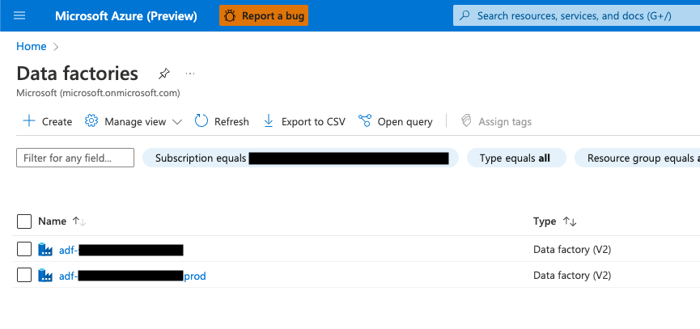
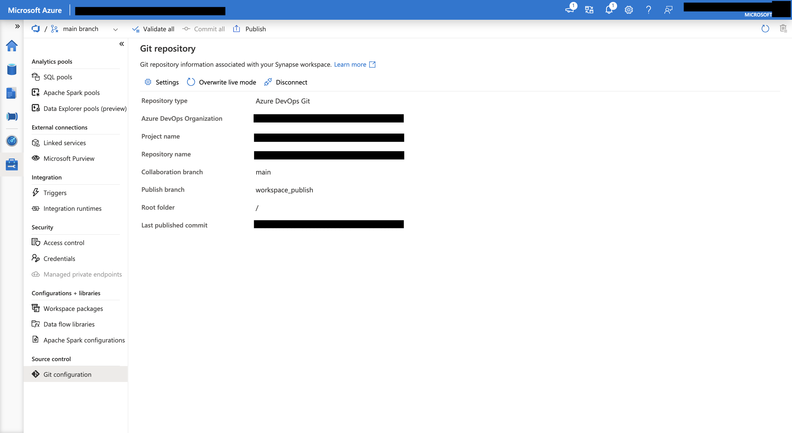

# Analytics CI/CD CLI

Command line tool for quickly setting up CI/CD for Azure Data Factory and Synapse Analytics.

## Table of Contents
  - [Overview](#overview)
  - [Solution Architecture](#solution-architecture)
  - [Usage](#usage)
  - [Result](#result)

## Overview

Azure Data Factory and Synapse Analytics both have built-in Git integration. With a few clicks, a user may link their workspace with a Git repository (in either GitHub or Azure DevOps) and start applying version control.

However, there is some additional complexity when we consider multiple environments - development, test and production, for example. There are multiple solutions to this problem, and the project team must carefully choose and set up a CI/CD mechanism that fits their needs.

This repository provides an interactive command line tool that helps you set up CI/CD for Data Factory and Synapse Analytics. This template is simple, yet effective and adaptable to most use-case scenarios, while following best practices around DevOps for Analytics.

## Solution Architecture

Below is the architecture diagram of this solution and how it interacts with your existing subscriptions.


The Analytics CI/CD Setup Tool will interact with the user, requesting them to choose the target subscriptions and workspaces. Then, it will collect the git configuration from the development workspace, and use the provided information to create the Deploy pipeline.

Triggering the Deploy pipeline will publish the development environment to production. The tooling will allow you to deploy the desired version, even if new features have been published and are under active development.

## Usage

| Step | Description | Detail |
| --- | ------------ | ----- |
| 1 | Create Data Factory or Synapse workspaces |  |
| 2 | Set up Azure DevOps project with a git repository |  |
| 3 | Connect your development workspace with the git repository |  |
| 4 | Set up Azure CLI <br> - Instal az cli <br> - Log in to the correct tenant <br> - Make sure the `datafactory` or `synapse`, as well as `devops` plugins are installed  | ----- |
| 5 | Clone this repository | ```git clone https://github.com/microsoft/ftatoolkit-analytics-cicd-cli.git``` |
| 6 | Run `sh setup.sh` |  |
| 7 | Follow the interactive prompts | ----- |
| 8 | Review newly created pipeline |  |

## Result

After executing the setup script, you may run the Workspace Deploy Pipeline to replicate your Development environment to Production whenever necessary. You may also customize the pipeline to better suit your use case, if necessary.

## Contributing

This project welcomes contributions and suggestions.  Most contributions require you to agree to a
Contributor License Agreement (CLA) declaring that you have the right to, and actually do, grant us
the rights to use your contribution. For details, visit https://cla.opensource.microsoft.com.

When you submit a pull request, a CLA bot will automatically determine whether you need to provide
a CLA and decorate the PR appropriately (e.g., status check, comment). Simply follow the instructions
provided by the bot. You will only need to do this once across all repos using our CLA.

This project has adopted the [Microsoft Open Source Code of Conduct](https://opensource.microsoft.com/codeofconduct/).
For more information see the [Code of Conduct FAQ](https://opensource.microsoft.com/codeofconduct/faq/) or
contact [opencode@microsoft.com](mailto:opencode@microsoft.com) with any additional questions or comments.

## Trademarks

This project may contain trademarks or logos for projects, products, or services. Authorized use of Microsoft 
trademarks or logos is subject to and must follow 
[Microsoft's Trademark & Brand Guidelines](https://www.microsoft.com/en-us/legal/intellectualproperty/trademarks/usage/general).
Use of Microsoft trademarks or logos in modified versions of this project must not cause confusion or imply Microsoft sponsorship.
Any use of third-party trademarks or logos are subject to those third-party's policies.
